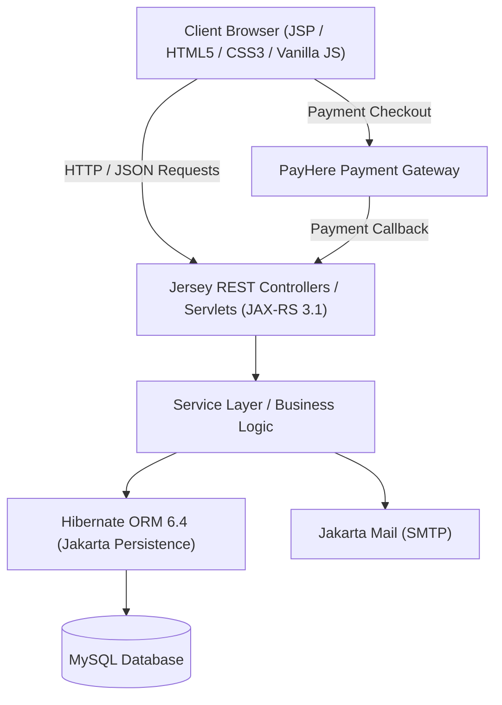

# ⚡ ElectroZone - Next-Gen Electronics E-Commerce Platform

[](https://www.oracle.com/java/)
[](https://jakarta.ee/)
[](https://eclipse-ee4j.github.io/jersey/)
[](https://hibernate.org/)
[](https://www.mysql.com/)
[](https://maven.apache.org/)

**ElectroZone** is a comprehensive, enterprise-grade e-commerce web platform designed for tech enthusiasts and electronics retailers. Built with **Jakarta EE 10**, **Jersey RESTful Services**, **Hibernate 6 ORM**, and **MySQL**, it provides a seamless shopping experience for customers and a robust management suite for administrators.

---

## 📑 Table of Contents

- [Features](#-features)
  - [Customer Experience](#-customer-experience)
  - [Admin Management](#-admin-management)
- [Architecture & Tech Stack](#-architecture--tech-stack)
- [Project Structure](#-project-structure)
- [Getting Started](#-getting-started)
  - [Prerequisites](#prerequisites)
  - [Database Setup](#1-database-setup)
  - [Configuration](#2-configuration)
  - [Build and Run](#3-build-and-run)
- [REST API Endpoints](#-rest-api-endpoints)
- [Database Schema](#-database-schema)
- [Payment Gateway Integration](#-payment-gateway-integration)
- [Email Notification System](#-email-notification-system)
- [Contributing](#-contributing)
- [License](#-license)

---

## ✨ Features

### 🛒 Customer Experience
- **Authentication & Security:**
  - Secure registration and login with **jBCrypt** password hashing.
  - Email verification with OTP via Jakarta Mail.
  - Password recovery / reset flow with expiring secure tokens.
  - "Remember Me" session persistence.
- **Product Discovery & Filtering:**
  - Advanced search and filtering by Category, Brand, Price range, Color, Storage capacity, and Condition/Quality.
  - Dedicated sections for **Deals**, **New Arrivals**, and Featured Products.
  - Rich Single Product view with multi-image gallery, real-time stock levels, specs, and related items.
- **Cart & Wishlist:**
  - Dynamic interactive Cart with quantity adjustments and live pricing.
  - Wishlist management for saving favorite items.
- **Checkout & Payment:**
  - Streamlined multi-step checkout with delivery address selection/creation.
  - Integrated **PayHere** payment gateway for secure card payments and instant order confirmation.
- **Orders & Invoices:**
  - Real-time order status tracking (e.g., `PENDING`, `PACKING`, `DELIVERED`, `CANCELED`).
  - Printable / downloadable digital invoices.
  - User account profile management and order history.

### 🛡️ Admin Management
- **Dashboard Analytics:** Real-time business overview with metrics on revenue, total orders, sales analytics, and customer counts.
- **Product & Stock Management:** Add, update, and manage products with multi-image file uploads, category/brand classification, pricing, discounts, and inventory control.
- **Order Management:** View and update order statuses, manage order items, shipping details, and track deliveries.
- **Customer Management:** View customer lists, purchase histories, and manage active/blocked account statuses.

---

## 🛠️ Architecture & Tech Stack



| Layer | Technologies / Libraries |
| :--- | :--- |
| **Backend Framework** | Jakarta EE 10 Web API, Jersey 3.1.2 (JAX-RS) |
| **Persistence / ORM** | Hibernate Core 6.4.4.Final, MySQL Connector/J 8.3.0 |
| **Security** | jBCrypt 0.4 (Blowfish password hashing), Custom Auth Filters |
| **Email Service** | Jakarta Mail 2.0.3, Angus Mail, RocketBase Email Template Builder |
| **JSON Handling** | Google Gson 2.10.1 |
| **Frontend / Views** | Jakarta Servlet Pages (JSP) 3.0, JSTL 3.0, Vanilla CSS & JavaScript |
| **Payment Gateway** | PayHere API & Web Checkout |
| **Build & Packaging** | Apache Maven, WAR packaging |

---

## 📂 Project Structure

```
ElectroZone/
├── pom.xml                               # Maven project configuration & dependencies
└── src/
    └── main/
        ├── java/lk/jiat/ElectroZone/
        │   ├── annotation/               # Custom annotations (e.g. auth guards)
        │   ├── config/                   # Jersey, AppConfig, and DB configuration
        │   ├── controller/               # JAX-RS REST API controllers
        │   │   └── api/                  # User, Admin, Product, Cart, Order, Payment APIs
        │   ├── dto/                      # Data Transfer Objects
        │   ├── entity/                   # Hibernate JPA entity models
        │   │   ├── Address.java
        │   │   ├── Order.java / OrderItem.java
        │   │   ├── Product.java / Stock.java
        │   │   ├── User.java / Seller.java
        │   │   └── ...
        │   ├── listener/                 # Context and Session listeners
        │   ├── mail/                     # Jakarta Mail integration & HTML templates
        │   ├── middleware/               # Authentication & role-based filters
        │   ├── provider/                 # Jersey exception mappers & filters
        │   ├── service/                  # Business logic services
        │   ├── util/                     # HibernateUtil, Security, Encryption helpers
        │   └── validation/               # Input validation handlers
        ├── resources/
        │   ├── app.properties            # App URLs, Mail SMTP, PayHere credentials
        │   ├── database.sql              # Initial database schema & seed data
        │   └── hibernate.cfg.xml         # Hibernate database connection settings
        └── webapp/
            ├── WEB-INF/                  # web.xml & secure deployment descriptors
            ├── admin/                    # Admin portal pages (dashboard, orders, products)
            ├── assets/                   # CSS, JavaScript, icons, and image assets
            ├── include/                  # Modular JSP partials (header, footer, nav)
            ├── index.jsp                 # Landing & Storefront Home
            ├── cart.jsp / checkout.jsp   # Shopping cart and checkout pages
            ├── products.jsp              # Catalog and search filters
            ├── single-product.jsp        # Product detail page
            ├── invoice.jsp               # Invoice generation view
            └── ...
```

---

## 🚀 Getting Started

### Prerequisites
Make sure you have the following installed on your local machine:
- **Java Development Kit (JDK):** Version 11 or higher (OpenJDK / Oracle JDK)
- **Apache Maven:** Version 3.8+
- **Database:** MySQL Server 8.0+
- **Servlet Container / Application Server:** Apache Tomcat 10+ (supporting Jakarta EE 10 / Servlet 6.0)

---

### 1. Database Setup

1. Start your MySQL server.
2. Create the database:
   ```sql
   CREATE DATABASE electrozone_db CHARACTER SET utf8mb4 COLLATE utf8mb4_unicode_ci;
   ```
3. Execute the initial seeds from [database.sql](src/main/resources/database.sql):
   ```sql
   USE electrozone_db;
   SOURCE src/main/resources/database.sql;
   ```
   *(Hibernate will automatically create and update table schemas upon first launch thanks to `hibernate.hbm2ddl.auto=update`)*.

---

### 2. Configuration

Update your database and external service settings:

#### 🔹 [hibernate.cfg.xml](src/main/resources/hibernate.cfg.xml)
Configure your MySQL database connection credentials:
```xml
<property name="hibernate.connection.url">jdbc:mysql://localhost:3306/electrozone_db?useSSL=false&amp;allowPublicKeyRetrieval=true&amp;serverTimezone=UTC</property>
<property name="hibernate.connection.username">your_mysql_username</property>
<property name="hibernate.connection.password">your_mysql_password</property>
```

#### 🔹 [app.properties](src/main/resources/app.properties)
Configure SMTP email credentials, application URLs, and PayHere merchant details:
```properties
# SMTP Email Configuration
mail.host=smtp.gmail.com
mail.port=587
mail.username=your-email@gmail.com
mail.password=your-app-password
app.mail=info.electrozone@gmail.com

# Application URLs
app.name=ElectroZone
app.url=http://localhost:8080/ElectroZone_war_exploded
app.public.url=http://localhost:8080/ElectroZone_war_exploded

# PayHere Payment Gateway
payhere.merchant.id=YOUR_PAYHERE_MERCHANT_ID
payhere.merchant.secret=YOUR_PAYHERE_MERCHANT_SECRET
```

---

### 3. Build and Run

1. **Build the WAR package:**
   ```bash
   mvn clean package
   ```
2. **Deploy to Apache Tomcat 10+:**
   - Copy the generated `target/ElectroZone.war` file into Tomcat's `webapps/` folder, **or**
   - Run directly through IntelliJ IDEA / Eclipse using the Tomcat 10 Run/Debug configuration with the `ElectroZone:war exploded` artifact.
3. Open your browser and navigate to:
   ```
   http://localhost:8080/ElectroZone_war_exploded/
   ```

---

## 📡 REST API Endpoints

The backend exposes RESTful endpoints structured under `/api/*`:

| Module | Endpoint | Method | Description |
| :--- | :--- | :--- | :--- |
| **Auth & User** | `/api/user/login` | `POST` | User authentication |
| | `/api/user/register` | `POST` | Create new customer account |
| | `/api/verification/verify` | `POST` | Verify email with OTP |
| | `/api/profile` | `GET` / `PUT` | View/update user profile |
| **Catalog** | `/api/product` | `GET` | List products with pagination |
| | `/api/single-product/{id}` | `GET` | Get product details by ID |
| | `/api/advanced-search` | `POST` | Filter products by multiple facets |
| **Cart & Wishlist** | `/api/cart` | `GET` / `POST` | Manage items in customer cart |
| | `/api/wishlist` | `GET` / `POST` | Manage items in wishlist |
| **Checkout & Orders** | `/api/checkout` | `POST` | Initiate checkout process |
| | `/api/payment/payhere-process` | `POST` | Generate PayHere checkout hash |
| | `/api/order` | `GET` / `POST` | Place orders and view order history |
| | `/api/invoice/{orderId}` | `GET` | Generate printable order invoice |
| **Admin** | `/api/admin/product` | `GET`/`POST`/`PUT`/`DELETE` | Full product lifecycle management |
| | `/api/admin/order` | `GET` / `PUT` | Manage and update order status |
| | `/api/admin/customers` | `GET` / `PUT` | Manage customer statuses |

---

## 💳 Payment Gateway Integration

ElectroZone is integrated with the **PayHere** payment gateway:
1. Customer initiates checkout with selected items and shipping address.
2. The server creates an order record in `PENDING` status and generates a secure MD5 hash using the `merchant_secret`.
3. Client invokes PayHere JavaScript SDK popup modal with payment parameters.
4. Upon successful transaction, PayHere notifies the application server via callback, and the order status updates to `APPROVED` / `PAID`.

---

## 📧 Email Notification System

Powered by **Jakarta Mail** and **RocketBase Email Template Builder**:
- **Welcome & Verification:** Sends an HTML email with a 6-digit OTP code to verify new user accounts.
- **Password Reset:** Generates a secure tokenized link for resetting forgotten passwords.
- **Order Confirmations & Invoices:** Sends real-time transaction updates and purchase summaries directly to the customer's inbox.

---

## 🤝 Contributing

Contributions, issues, and feature requests are welcome!
1. Fork the project.
2. Create your feature branch (`git checkout -b feature/AmazingFeature`).
3. Commit your changes (`git commit -m 'Add some AmazingFeature'`).
4. Push to the branch (`git push origin feature/AmazingFeature`).
5. Open a Pull Request.

---

